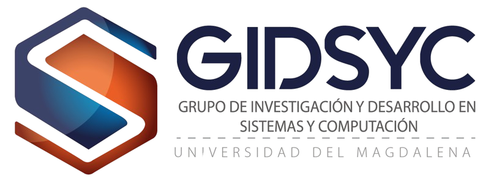

# GIDSYC - Grupo de Investigación en Sistemas y Computación

Este es el repositorio oficial del Semillero de Investigación GIDSYC de la Universidad del Magdalena. La plataforma ha sido diseñada para proyectar la pasion por la investigación, la innovación y la excelencia académica en el campo de la Inteligencia Artificial y el Desarrollo de Software.

## Visita la página

Puedes acceder a la versión desplegada del sitio en el siguiente enlace:
[https://gidsyc-page.vercel.app/](https://gidsyc-page.vercel.app/)

Desarrollado por el equipo de GIDSYC - Universidad del Magdalena.
© 2026 GIDSYC. Todos los derechos reservados.
